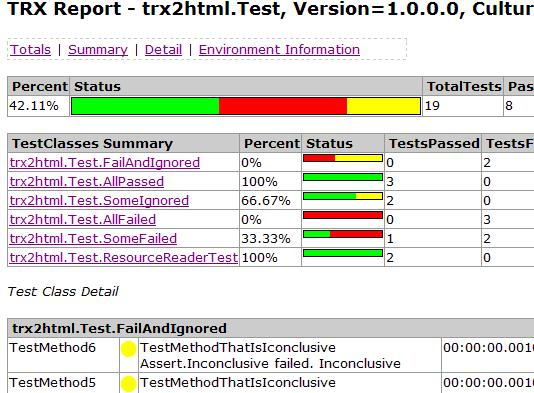

Converts Visual Studio TestResults files to html with agregate information, making easier the inspection of test results

Version 0.6 supports Test Results for VS2005, 2008 and 2010

Version 0.7. Is based on LINQ (easier to mantain) but only supports TestResults created with VS2010, and requires .Net 4.0

Update 26Jan2013 Version 0.7.3 supports trx created with VS 2012

[CurrentFeatures](CurrentFeatures)



More info on: [http://blogs.msdn.com/b/rido/archive/tags/trx2html](http://blogs.msdn.com/b/rido/archive/tags/trx2html)

# Docker

A docker container was added which can be utilized in a Gitlab Job for generating HTML from TRX Files.

As the docker image is not published so you'll have to create and host the image yourself.

## Usage

Execute Pipeline from generated image.

```
jobName:
  image: locationOfPersonalImage:trx2html
  tags:
    - yourDockerExecutor
  script:
    - /app/trx2html <file/directory>
  artifacts:
    paths:
      - directory
```
